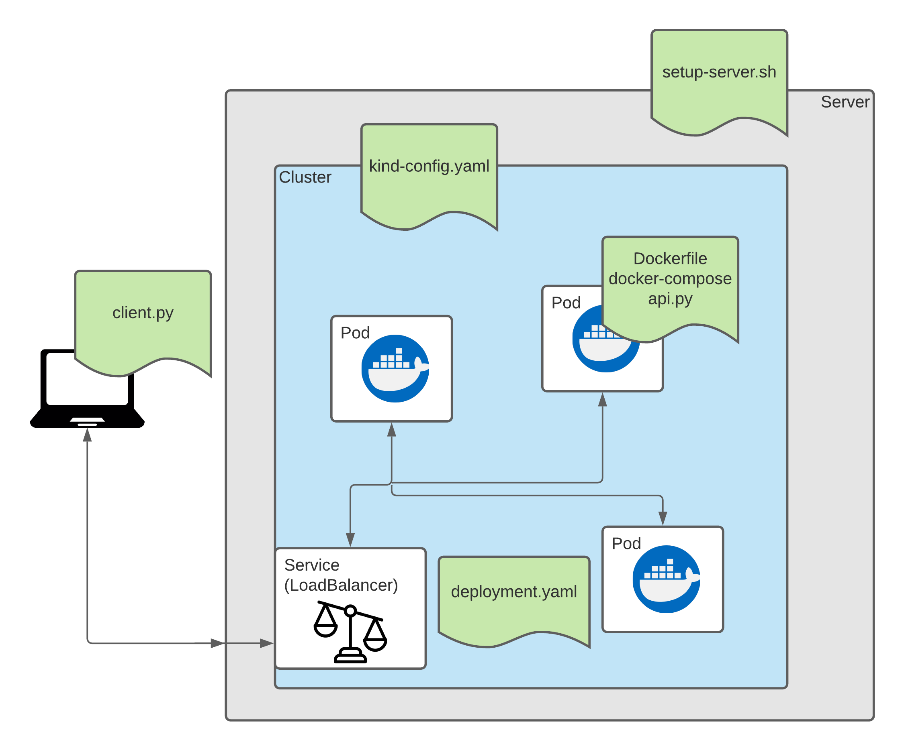
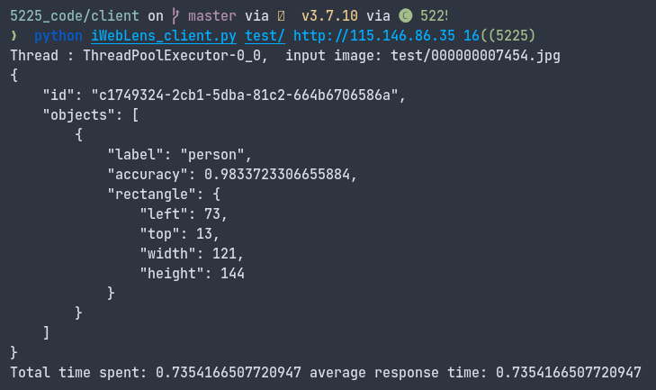

TagTag: A Modern Image Storage on the Cloud

Image-search-engine aims at developing a cloudified solution using AWS where a user uploads images and can retrieve the URLs of the images by specifying the tags(objects detected from the images) using AWS services such as Simple Storage Service (S3), Lambda, API Gateway and Cognito

- [Github Repo](https://github.com/yohanderose/Image-Search-Engine.git)




## Dependencies 🐳

- Ubuntu 18.04
- Docker
- Python > 3.5

## Usage ️️️️️️️️️⚙️

```bash
git clone https://github.com/yohanderose/object-detection-webservice.git
cd object-detection-webservice
```

### Server

```bash
bash setup-server.sh
```

This script:

1. Installs remaining dependencies (kubectl, kind)
2. Starts docker, creates cluster and spins up the deployment

### Client

Interact with your server using

```bash
python client/iWebLens_client.py <path to dir of images>/ http://<server ip> <num threads>
# example: python iWebLens_client.py test/ http://localhost 16
# yohan's server: python iWebLens_client.py test/ http://118.138.237.116 16
```


